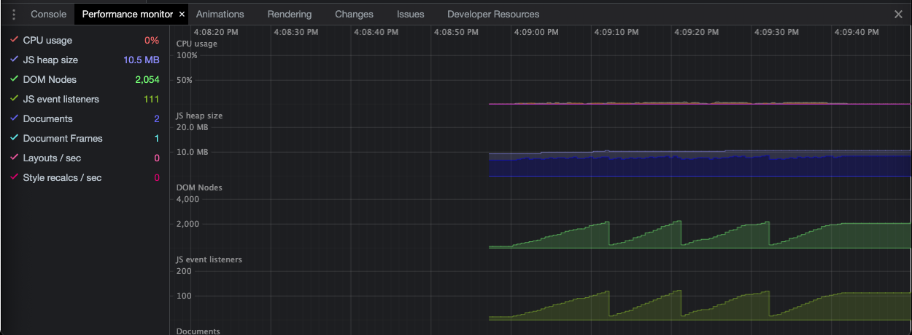

# Routertest

## Steps to reproduce

1. Clone repo.
2. Run `npm install`.
3. Run `ng serve`.
4. Open Chrome Dev Tools.
5. Open the "Performance monitor". You can access this by clicking the the three dots in the top right of the dev tools. From here, go to "More tools" and then click "Performance monitor".
6. Identify the "DOM Nodes" and "JS event listeners" sections.
7. Click the "Go to inner" link.
8. Click the "Go back" link.
9. Repeat steps 7 and 8 several times. Observe that the "DOM Nodes" and "JS event listeners" graphs eventually form a saw tooth pattern. Note: You may need to click quickly for the saw tooth pattern to appear.

